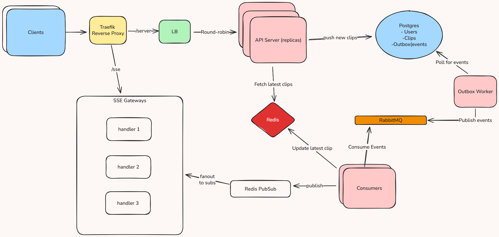

# ClipRelay

ClipRelay is a lightweight, high-performance system for transferring text and image clips across devices through real-time streaming. 

It solves a practical workflow issue: moving clipboard content from a Windows PC to a tablet used for handwritten note-taking. Existing tools (such as Samsung Notes sync and OEM clipboard sharing) frequently introduce sync delays, conflict issues, and inconsistent cross-device behavior. ClipRelay provides a fast, predictable, and conflict-free syncing mechanism using a distributed, event-driven backend.


## Highlights

- High-throughput API layer with multiple replicas behind a load balancer for parallel clip ingestion.  
- Consistent-hashing–based SSE gateway assignment for stable routing and scalable real-time streaming.  
- Outbox → RabbitMQ → Redis Pubsub event pipeline ensuring durable, predictable, and lightweight propagation.  
- Redis LWW (Last-Write-Wins) state store providing deterministic, idempotent updates under at-least-once delivery.  
- Presigned S3-compatible blob handling enabling reliable and conflict-free image synchronization.  
- Sustains **9k requests/sec** (text clip creation) across API replicas, **16k Transactions/sec** on Postgres with **0 SSE drops**.  Thoughput can be improved by dropping GORM and using SQL queries instead.

---

# High-Level Design

ClipRelay is composed of several independent Go services working together through message passing, Redis caching, and SSE-based real-time propagation.

<p align="center">
  
</p>


## API Server

The API Server handles all client-facing operations:

- Accepting new text clips  
- Returning presigned URLs for blob (image) uploads  
- Storing clip metadata (including blob URLs)  
- Routing clients to the correct SSE handler via consistent hashing  
- Returning the latest clip state  

When a clip or blob metadata is received, the API server performs two writes in the same database transaction:

1. Store the clip record (text or blob metadata)  
2. Insert a corresponding event row into the Outbox table  

The API server never communicates with RabbitMQ directly.  
The Outbox table forms the atomic boundary between the synchronous request path and the asynchronous event pipeline.

---

## Outbox Worker

A separate Go service continuously processes the Outbox table.

- Fetches batches of unprocessed Outbox rows  
- Publishes their events to RabbitMQ  
- Marks those rows as published  

This provides **at-least-once** delivery to the message queue.  
If an older or retried Outbox entry reappears, correctness is preserved downstream through timestamp-based conflict handling.

---

## MQ Consumers

RabbitMQ consumers process events published by the Outbox Worker.  
Each consumer updates the system’s authoritative real-time state.

For every event (text or blob):

1. The consumer checks the event timestamp against the Redis cached timestamp  
2. Redis is only updated if the incoming event is strictly **newer**  
3. The updated state is then published to Redis Pub/Sub  

### Blob Handling

Blob propagation works the same way as text, except the consumer incorporates:

- The blob’s presigned get URL (to download and render images)
- Any derived metadata needed by the front-end  

Consumers publish these updated blob URLs into Redis and Pub/Sub so all connected devices immediately receive the new image.


### Idempotent Effects (LWW)

The Redis update uses timestamp-based **last-write-wins (LWW)** conflict resolution.

This guarantees:

- Duplicate RabbitMQ messages do not cause duplicate SSE pushes  
- Stale messages never override newer state  
- The system achieves **exactly-once effects**, even though message delivery is at-least-once  

---

## SSE Event Handlers

Real-time updates are delivered through multiple SSE handlers running in parallel.

ClipRelay uses a **consistent hash ring** to assign each user/device to a specific SSE handler:

- Ensures stable routing  
- Allows horizontal scaling of handlers  
- Minimizes reshuffling when adding/removing handlers  

Each SSE handler:

- Subscribes to Redis Pub/Sub channels  
- Receives broadcasted clip updates (text or blob URLs)  
- Streams the changes to connected clients immediately  

Devices always receive the latest clip with correct ordering and without duplicates.

---

# API Endpoints

| Endpoint | Method | Description |
|---------|--------|-------------|
| `/login` | POST | Authenticate a user and return a JWT token. |
| `/clips` | GET | Fetch paginated clips. Supports `?before=<clip_id>` for backwards pagination. |
| `/clips/latest` | GET | Fetch the latest clip from Redis for low-latency state retrieval. |
| `/sse` | GET | Return the assigned SSE gateway for the authenticated user. |
| `/events/{gateway_id}` | GET | Establish an SSE stream with the assigned gateway (requires `token=<JWT>` query param). |

---
# Why ClipRelay Exists

Transferring clipboard content from a Windows PC to a tablet—especially during coding, researching, and handwritten note-taking—was unreliable using vendor ecosystem syncing tools.

Existing solutions suffer from:

- Sync delays  
- Conflict issues during rapid content changes  
- Inconsistent cross-device propagation  
- Poor blob handling workflows  
- Manual copy-paste workarounds  

ClipRelay eliminates these issues by providing:

- Immediate real-time clip delivery  
- Reliable propagation of both text and image blobs  
- Strong consistency using timestamp-based conflict resolution  
- Device-agnostic behavior  
- Low-latency, predictable UI updates via SSE  

ClipRelay is built as a clean, reliable solution to a real personal workflow problem, with an architecture designed to be understandable, scalable, and correct.

---

# Deployment

ClipRelay is currently deployed at:

https://cliprelay.karishch.online/login.html

The deployment is served through a Cloudflare Tunnel that connects directly to a local development machine.  
Because it relies on the availability of that machine and its local network ports, the service may occasionally be inaccessible or temporarily offline.

## Running ClipRelay Locally

You can run the entire backend stack locally using the provided Docker Compose setup.  
A Makefile is included so everything can be started with a single command:

```
make cliprelay-start
```

This will launch all backend services (API Server, Outbox Worker, MQ Consumer, Redis, RabbitMQ, Postgres, SSE Gateways, and MinIO) and automatically start the frontend server so ClipRelay is accessible in your browser.

To stop all services:

```
make cliprelay-end
```


### Blob Handling (IMPORTANT!)

ClipRelay supports both text and image/blob propagation.  
In production this works through an external S3-compatible provider using presigned URLs.

For **local development**, blob propagation requires a small amount of additional configuration because the backend (inside Docker) and frontend (on your host machine) reach MinIO using different endpoints. A custom MinIO dialer and URL-rewrite solution is included to handle this.

The full explanation and required code changes are documented in:

```
./server/README.md
```

If you are testing blob/image syncing across multiple devices on your local network, make sure to read that file — it describes how the MinIO setup works and how ClipRelay rewrites blob URLs so they resolve correctly outside the Docker network.


